# Documentación Proyecto Sudoku

## 1. Análisis de requerimentos

### Requisitos funcionales

- RF-001: Generación de tablero
- RF-002: Lógica interna de backtracking
- RF-003: Validación de movimientos
- RF-004: Colocación de números
- RF-005: Comprobación de final
- RF-006: Interfaz de consola (JuegoSudoku)
- RF-007: Interfaz gráfica Swing (SudokuGUI)
- RF-008: Reinicio y cambio de dificultad (GUI)

| ID      | Descripción  | Prioridad         | Fuente       | Estado |
| ------- | ---------------------------------------------------------------------------------------------------------- | ------------ | ------------------------------------------------ | ------------ |
| RF-01 | Generación de tablero 9x9 de Sudoku.        | Alta     | Requisitos internos    | Completado  |
| RF-02 | Lógica interna de backtracking. | Alta   | Requisitos internos      | Completado   |
| RF-03 | Validación de movimientos.    | Alta   | Requisitos internos      | Completado  |
| RF-04 | Colocación de números en casillas vacías        | Alta     | Requisitos internos | Completado   |
| RF-05 | Comprobación de que se ha resuelto correctamente el tablero     | Alta   | Requisitos internos      | Completado  |
| RF-06 | Interfaz de consola con la clase JuegoSudoku | Media  | Requisitos internos    | Completado   |
| RF-07 | Interfaz de gráfica Swing con la clase SudokuGUI | Alta  | Requisitos internos    | Completado   |
| RF-08 | Reinicio y cambio de dificultad | Media  | Requisitos internos    | Completado   |

### Requisitos no funcionales

| ID      | Descripción                                        | Categoría       | Métrica                                        | Nivel Objetivo    | Comentarios                                          |
| ------- | -------------------------------------------------- | --------------- | ---------------------------------------------- | ----------------- | ----------------------------------------------------- |
| RNF-01  | Latencia de validación tras pulsar Enter en GUI    | Usabilidad      | Tiempo medio entre Enter y respuesta de validación | ≤ 100 ms         | Mide la fluidez de la interacción en la interfaz     |
| RNF-02  | Tiempo de arranque de la aplicación                 | Rendimiento     | Tiempo hasta que la ventana principal es visible   | ≤ 2 s            | Incluye generación inicial del tablero               |
| RNF-03  | Cobertura de pruebas unitarias                     | Mantenibilidad  | % de líneas de código cubiertas por tests          | ≥ 80 %           | Debe incluir lógica de Sudoku y componentes GUI      |
| RNF-04  | Consumo máximo de memoria durante ejecución        | Rendimiento     | Uso máximo de heap al jugar varias rondas          | ≤ 150 MB         | Medido usando herramientas de profiling Java         |
| RNF-05  | Compatibilidad multiplataforma                      | Portabilidad    | Plataformas soportadas sin cambios en el código    | Windows, macOS, Linux | Requiere Java 11+                                   |
| RNF-06  | Documentación completa con JavaDoc                  | Mantenibilidad  | % de clases y métodos documentados en JavaDoc      | ≥ 90 %           | Incluir ejemplos de uso en README                    |
| RNF-07  | Robustez ante entradas inválidas                    | Confiabilidad   | % de casos de entrada que no provocan crash       | ≥ 99 %           | Captura y maneja `NumberFormatException` y otras    |

### Objetivos

| **ID**   | **Objetivo SMART**                                                                                               | **Tipo**        | **Métrica**                                                   | **Fecha Límite** | **Responsable**        | **Estado**     |
| -------- | ----------------------------------------------------------------------------------------------------------------- | --------------- | ------------------------------------------------------------- | ---------------- | ---------------------- | -------------- |
| OBJ-01   | Generar tableros de Sudoku para “facil”, “medio” y “dificil” con ≤30, ≤40 y ≤50 celdas vacías respectivamente     | Táctico         | % de tableros generados que cumplen el umbral de celdas vacías | 2025-05-23       | Equipo de Lógica       | Terminado    |
| OBJ-02   | Completar el algoritmo de backtracking para llenar el tablero en ≤500 ms por tablero                              | Operativo       | Latencia media de `fillBoard()`                               | 2025-05-23       | Equipo de Lógica       | Terminado    |
| OBJ-03   | Validar movimientos en la GUI en ≤100 ms sin falsos positivos ni negativos                                         | Operativo       | Tiempo medio de validación / % de aciertos erróneos           | 2025-05-23       | Equipo de UI/UX        | Terminado    |
| OBJ-04   | Desplegar interfaz gráfica con filtros de entrada, bordes 3×3, alternancia de color y reinicio “Nuevo”           | Táctico         | % de requisitos GUI implementados                             | 2025-05-23       | Equipo de UI/UX        | Terminado    |
| OBJ-05   | Proveer interfaz de consola que imprima el tablero tras cada jugada válida y gestione errores de formato         | Operativo       | % de flujo de consola cubierto / Nº de casos de error manejados | 2025-05-23       | Equipo de Consola      | Terminado    |
| OBJ-06   | Alcanzar cobertura de pruebas unitarias ≥ 80 % para lógica de Sudoku y generación de tableros                       | Mantenibilidad  | % de líneas de código cubiertas por tests                     | 2025-05-23       | Equipo de QA           | Terminado    |
| OBJ-07   | Documentar 100 % de las clases y métodos con JavaDoc y ejemplos de uso en README                                 | Mantenibilidad  | % de elementos con documentación JavaDoc                      | 2025-05-23       | Equipo de Documentación | Terminado    |
| OBJ-08   | Garantizar compatibilidad en Windows, macOS y Linux con Java 11+ sin ajustes en el código                        | Estratégico     | Nº de plataformas soportadas sin modificaciones               | 2025-05-23      | Equipo de Infraestructura | Terminado  |

## 2. Diagrama(s) UML (clases y casos de uso)

### Diagrama de clases

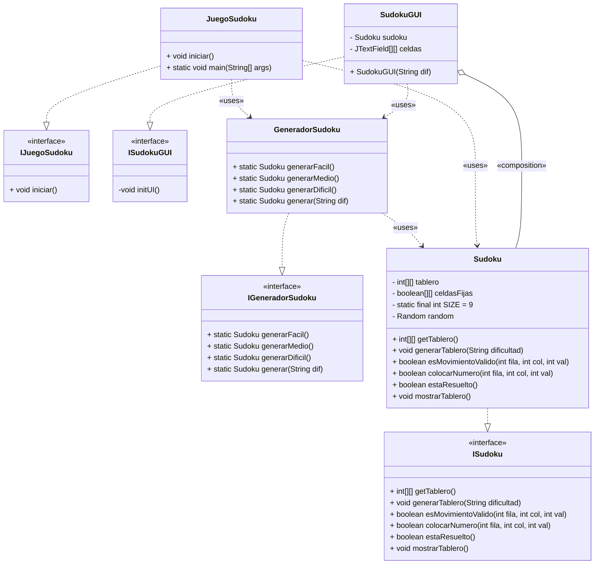

### Diagrama de casos de uso

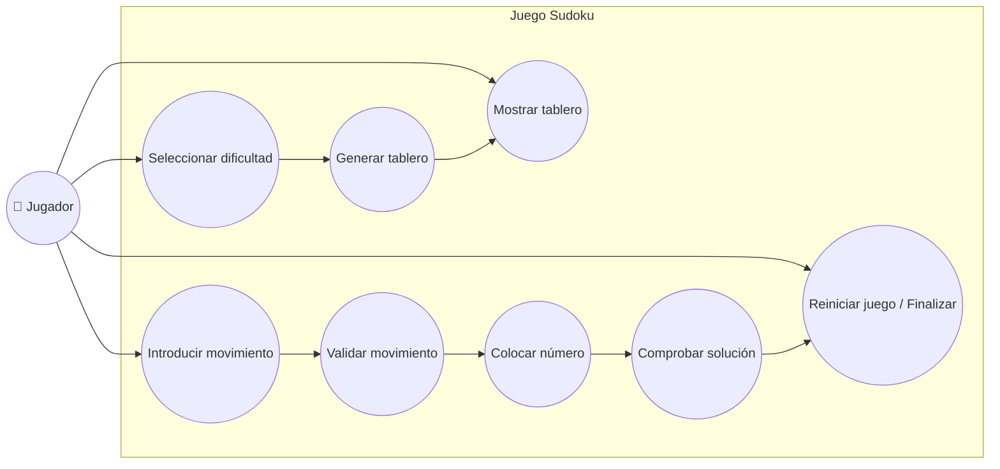

## 3. Matriz de trazabilidad

| **Req. ID** | **Descripción Req.**                                                                 | **Módulo / Clase / Método**                                                      | **Caso de Prueba**                                          |
|-------------|--------------------------------------------------------------------------------------|----------------------------------------------------------------------------------|-------------------------------------------------------------|
| RF-01       | Generación de tablero 9×9 con casillas vacías según dificultad                       | `GeneradorSudoku` / `generarFacil()`, `generarMedio()`, `generarDificil()`, `generar(String)` | `generarFacil()`,  `generarMedio()`,  `generarDificil()`,  `generar()` |
| RF-02       | Lógica interna de backtracking para completar tablero válido                         | `Sudoku` / `fillBoard()`, `esValido()`, `shuffleArray()` | `esMovimientoValido()` ,   `colocarNumero()` ,   `estaResuelto()`        |
| RF-03       | Validación de movimientos según reglas de filas, columnas y subcuadrículas           | `Sudoku` / `esMovimientoValido()`, `esValido()`                                    | `esMovimientoValido()`                   |
| RF-04       | Colocación de números en casillas vacías con verificación de celda fija y rango      | `Sudoku` / `colocarNumero()`                                                       | `colocarNumero()` (test movimientos inválidos)|
| RF-05       | Verificación de victoria cuando el tablero está completo y válido                    | `Sudoku` / `estaResuelto()`                                                         |  `estaResuelto()` (En GUI al resolver) |
| RF-06       | Interfaz de consola mostrando tablero en ASCII y leyendo jugadas                    | `JuegoSudoku` / `iniciar()`, `main()`                                              | `mostrarTablero()`         |
| RF-07       | Interfaz gráfica Swing con grid 9×9, filtros de entrada, bordes y validación Enter  | `SudokuGUI` / `initUI()`, `CellListener.actionPerformed()`                         | (No automatizado: se prueba manualmente en GUI)             |
| RF-08       | Reinicio y cambio de dificultad en GUI                                               | `SudokuGUI` / `main()`, botón “Nuevo” o menú Archivo→Nuevo                         | (Manual: se prueba reinicio y cambio de dificultad)         |
| RNF-01      | Latencia de validación tras pulsar Enter en GUI                                      | `SudokuGUI` / `CellListener.actionPerformed()`                                     | (Medición de rendimiento manual o con herramienta de perfil)|
| RNF-02      | Tiempo de arranque de la aplicación                                                  | `SudokuGUI` / `main()`                                                             | (Medición de tiempo de arranque con profiler)               |
| RNF-03      | Cobertura de pruebas unitarias ≥80 %                                                 | Todo el código / tests JUnit                                                       | Observar comparativa entre pruebas unitarias y métodos y funciones               |
| RNF-04      | Consumo máximo de memoria durante ejecución                                          | `Sudoku`, `GeneradorSudoku`, `SudokuGUI`                                           | (Medición con herramienta de profiling de memoria)          |
| RNF-05      | Compatibilidad multiplataforma (Windows, macOS, Linux)                               | Todo el proyecto / Java 11+                                                        | (Test de arranque en cada plataforma)                       |
| RNF-06      | Documentación completa con JavaDoc en ≥90 % de clases y métodos                      | Todo el código / JavaDoc                                                             | Informe de documentación generada                           |
| RNF-07      | Robustez ante entradas inválidas sin provocar crash                                 | `Sudoku` / `colocarNumero()`, `esMovimientoValido()`,  `SudokuGUI`/`CellListener` | Las entradas del usuario están delimitadas dentro del rango correcto                            |

## 4.Pruebas unitarias JUnit

### Clase GeneradorSudokuTest

**generarFacil()**

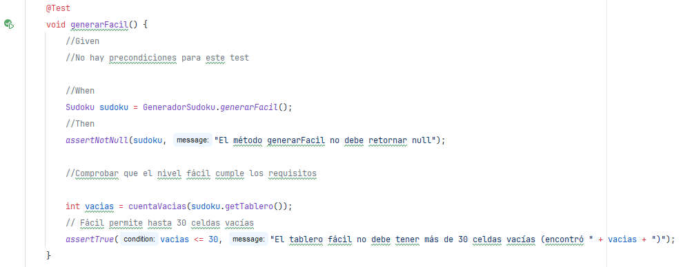

Comprueba que las celdas vacías a rellenar concuerden con las que debe tener la dificultad fácil.

**generarMedio()**

Comprueba que las celdas vacías a rellenar concuerden con las que debe tener la dificultad media.

**generarDificil()**

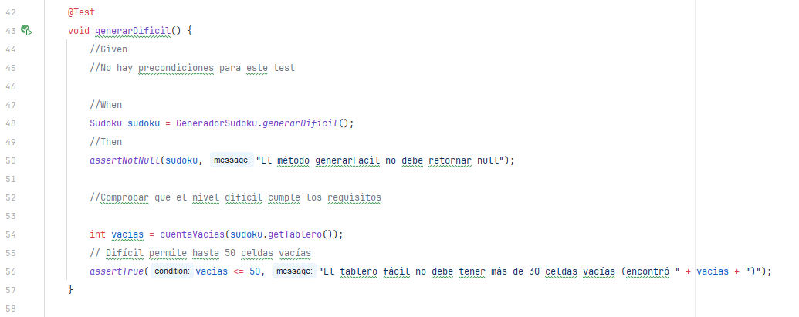

Comprueba que las celdas vacías a rellenar concuerden con las que debe tener la dificultad difícil.

*Durante los tests se ha usado esta función para evitar la repetición del código*

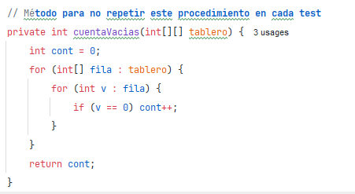

**generar()**

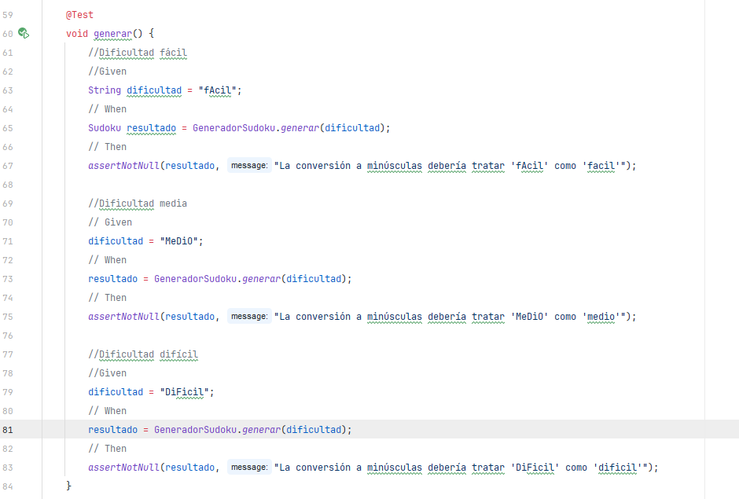

Comprueba que se genere el tablero acorde con la dificultad deseada.

### Clase SudokuTest

**getTablero()**

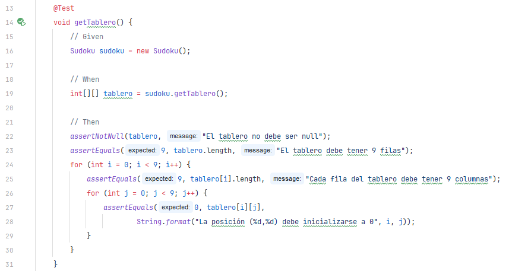

Comprueba que el tablero se genere correctamente

**generarTablero()**

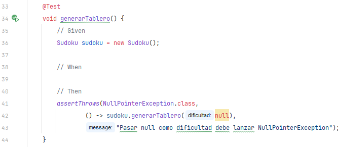

Comprueba que se genere el tablero

**esMovimientoValido()**

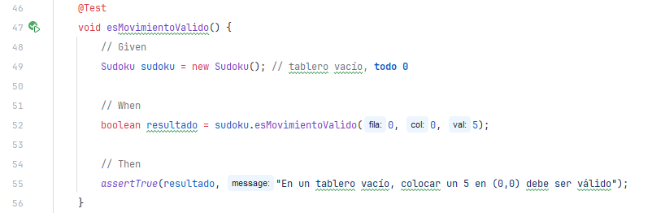

Comprueba que el movimiento es válido

**colocarNumero()**

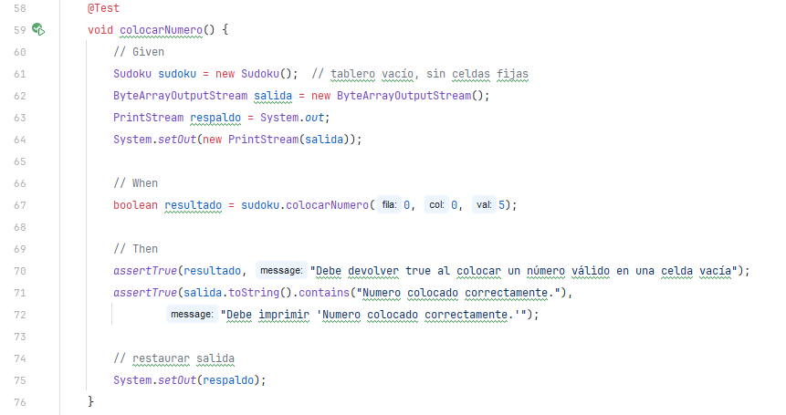

Comprueba que se coloca el número correctamente cuando el número es válido

**estaResuelto()**

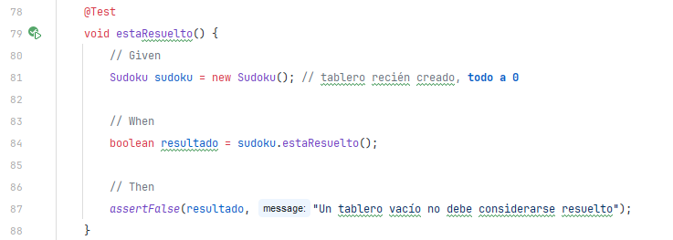

Comprueba que solo se considere resuelto un tablero relleno (solo se rellena una casilla cuando la respuesta es correcta)

**mostrarTablero()**

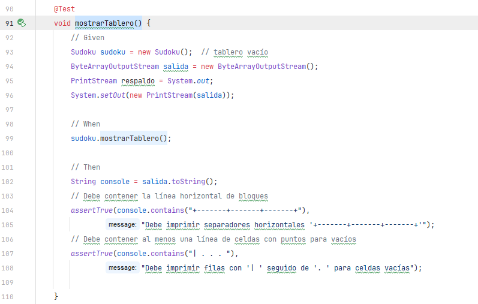

Comprueba de que se imprima en pantalla el sudoku cuando se llame a la función